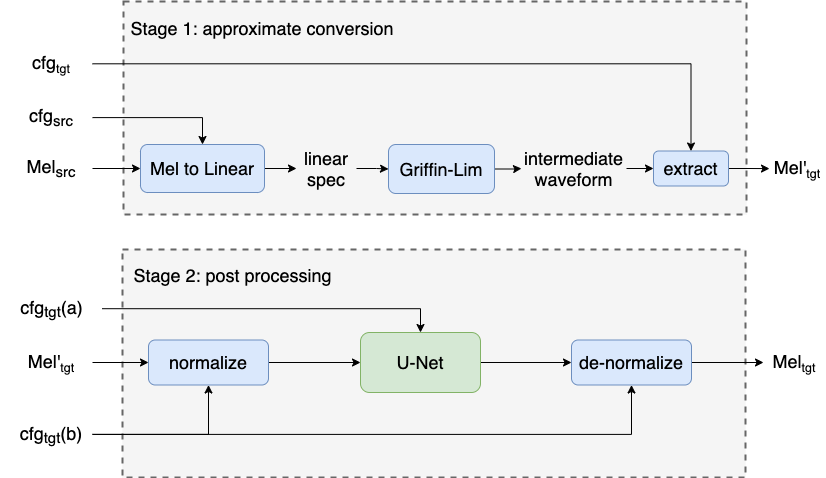

# Acoustic-feature-converter

Official repository for 'Universal Adaptor: Converting Mel-Spectrograms Between Different Configurations for Speech Synthesis'

**Abstract :**
Most recent TTS systems are composed of a synthesizer and a vocoder. However, the existing synthesizers and vocoders can only be matched to a specific configuration. Hence, we can't combine arbitrary synthesizers and vocoders together to form a complete TTS system, not to mention applying to a newly developed model. In this paper, we proposed a universal adaptor, which takes a Mel-spectogram parametrized by the source configuration and converts it into a Mel-spectrogram parametrized by the target configuration, as long as we feed in the source configuration and target configuration. Our experiments have shown that the quality of speeches synthesized from our output of the universal adaptor is comparable to those synthesized from ground truth Mel-spectrogram. Moreover, our universal adaptor can be applied in the recent TTS systems and in multi-speaker speech synthesis.

Visit our [demo website](https://bogihsu.github.io/Acoustic-feature-converter/demo/demo.html) for audio samples.

## Installation

Install the requirements by pip:

    pip install -r requirements.txt

## How To Use

### Train Your Own Model

All the procedures are written in `run.sh`. All you have to do is to fill in the expected folder names and run the command:

    bash run.sh

### Inference with Pretrained Models

If you want to skip the training and inference directly, there are two steps to do.

1. We have to pass through Stage 1 by `transform.py`.

    python3 transform.py -sc source_config -tc target_config -d data_dir -o out_dir

2. We pass through Stage 2 by the stage 2 in `run.sh`. Fill in the expected folder names and run the command:

    bash run.sh

Then, you can find the results in your output directory.

### Other Files

`generate.py`: can help you turn the waveforms into the acoustic features with the configuration you want.

## Configuration Tables

1. LJSpeech

Source Configuration: cfg1, cfg2, cfg3, cfg4
Target Configuration (Vocoder): cfg1(WaveRNN), cfg2(WaveGLOW), cfg3(HiFiGAN), cfg4(MelGAN)

2. Text-to-Speech

Source Configuration (TTS): cfg1(Tacotron), cfg2(Tacotron 2), cfg3(FastSpeech 2)
Target Configuration (Vocoder): cfg1(WaveRNN), cfg2(WaveGLOW), cfg3(HiFiGAN), cfg4(MelGAN)

3. CMU_ARCTIC

Source Configuration: cfg1, cfg2, cfg3, cfg4
Target Conifguration (Vocoder): cfg3(HiFiGAN)

### Reference Repositories for Configurations

* [Efficient Neural Audio Synthesis](https://github.com/fatchord/WaveRNN)
* [WaveGlow: A Flow-based Generative Network for Speech Synthesis](https://github.com/NVIDIA/waveglow)
* [MelGAN: Generative Adversarial Networks for Conditional Waveform Synthesis](https://github.com/descriptinc/melgan-neurips)
* [HiFi-GAN: Generative Adversarial Networks for Efficient and High Fidelity Speech Synthesis](https://github.com/jik876/hifi-gan)
* [Parallel WaveGAN: A fast waveform generation model based on generative adversarial networks with multi-resolution spectrogram](https://github.com/kan-bayashi/ParallelWaveGAN)
* [WaveNet: A generative model for raw audio](https://github.com/r9y9/wavenet_vocoder)